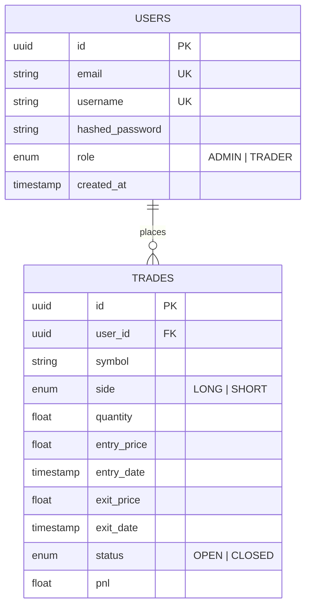

# 📈 TradeLog

**TradeLog** is a high-performance trading journal and analytics platform designed for professional traders. It offers institutional-grade analytics, real-time equity curves, and bank-grade security.

The platform features a dual-role system: **Traders** for personal journaling and **Admins** for platform-wide monitoring and risk management.

## 🚀 Features

### 🧑‍💻 For Traders

- **Trade Execution:** Log Long/Short positions for any asset class (Crypto, Forex, Stocks).
- **Analytics Engine:** Real-time calculation of **Net PnL**, **Profit Factor**, **Win Rate**, and **Average Win/Loss**.
- **Visualizations:** Interactive Equity Curve (Area Charts) and Win/Loss distribution.
- **Journaling:** Filter trades by Open/Closed status and detailed history tracking.

### 🛡️ For Admins

- **Global Monitoring:** View total platform users, active positions, and total volume.
- **Leaderboard:** Monitor top profitable trades and identifying high-performing users.
- **Risk Management:** Track platform-wide PnL exposure.

### ⚙️ Technical Highlights

- **Backend:** High-performance REST API using **FastAPI (Python 3.11)**.
- **Database:** robust **PostgreSQL 15** with **SQLAlchemy** ORM and **Alembic** migrations.
- **Frontend:** Responsive SPA built with **React 19**, **TypeScript**, and **Tailwind CSS**.
- **Security:** JWT Authentication, Rate Limiting (SlowAPI), and BCrypt password hashing.
- **DevOps:** Fully Dockerized environment with Nginx reverse proxy.

---

## 🛠 Tech Stack

| Component          | Technology                                               |
| :----------------- | :------------------------------------------------------- |
| **Frontend**       | React 19, TypeScript, Vite, TailwindCSS, Recharts, Axios |
| **Backend**        | FastAPI, Pydantic, SQLAlchemy, SlowAPI                   |
| **Database**       | PostgreSQL 15                                            |
| **Infrastructure** | Docker, Docker Compose, Nginx (Alpine)                   |

---

## 🔌 Database Design

The application uses a relational schema optimized for financial data integrity.



---

## ⚡ Getting Started

The project is fully containerized. You do not need to install Python or Node.js locally to run the application.

### Prerequisites

- **Docker** and **Docker Compose** installed on your machine.

### Installation & Running

1.  **Clone the repository:**

    ```bash
    git clone https://github.com/PratikC07/TradeLog.git
    cd tradelog
    ```

2.  **Start the application:**
    This command will build the images, run database migrations, seed initial data, and start the services.

    ```bash
    docker-compose up --build
    ```

3.  **Access the Application:**

    - **Frontend (App):** [http://localhost:3000](https://www.google.com/search?q=http://localhost:3000)
    - **Backend Docs (Swagger UI):** [http://localhost:8000/docs](https://www.google.com/search?q=http://localhost:8000/docs)

---

## 🔐 Default Accounts

The application automatically seeds the database with a set of users for testing purposes.

### 1\. Admin Account (Monitoring Only)

Use this account to view global statistics, total platform PnL, and top-performing trades.

- **Email:** `admin@gmail.com`
- **Password:** `admin123`

### 2\. Trader Accounts (Demo Data)

Use these accounts to simulate trading activity, add new trades, and view individual analytics.

| Persona        | Email                | Password  | Description                              |
| :------------- | :------------------- | :-------- | :--------------------------------------- |
| **The Winner** | `charlie@winner.com` | `pass123` | High profitability, good win rate.       |
| **The Active** | `alice@trader.com`   | `pass123` | Mix of open and closed positions.        |
| **The Loser**  | `bob@loser.com`      | `pass123` | Negative PnL (for testing loss metrics). |

> **Note:** You can also register a new account via the Signup page to start with a fresh journal.

---

## 📡 API Contracts

The backend exposes a RESTful API. Below are the core endpoints.

### Auth

- `POST /auth/register`: Create a new trader account.
- `POST /auth/login`: Authenticate and retrieve JWT Bearer token.

### Dashboard & Analytics

- `GET /analytics/summary`: Polymorphic endpoint. Returns **UserAnalyticsSummary** for traders or **AdminAnalyticsSummary** for admins.
- `GET /analytics/chart`: Returns PnL equity curve data points.
- `GET /analytics/admin/top-trades`: **(Admin Only)** Fetches the top 5 most profitable trades globally.

### Trades (CRUD)

- `GET /trades/`: Fetch paginated trade history (supports status filtering).
- `POST /trades/`: Open a new trade position.
- `PUT /trades/{id}`: Update trade details.
- `PATCH /trades/{id}/close`: Close an open position.
- `DELETE /trades/{id}`: Remove a trade entry.

---

## 📂 Project Structure

```
TradeLog/
├── client/                 # React Frontend
│   ├── src/
│   │   ├── components/     # Reusable UI components
│   │   ├── features/       # Logic split by domain (Auth, Dashboard, Journal)
│   │   └── lib/            # Axios setup & Utils
│   └── Dockerfile          # Multi-stage build (Node -> Nginx)
│
├── server/                 # FastAPI Backend
│   ├── alembic/            # Database Migrations
│   ├── src/
│   │   ├── analytics/      # Analytics logic
│   │   ├── auth/           # JWT & Authentication
│   │   ├── database/       # DB Connection & Core
│   │   ├── entities/       # SQLAlchemy Models
│   │   ├── trades/         # Trade Management
│   │   └── users/          # User Management
│   ├── entrypoint.sh       # Startup script (Migration + Seeding)
│   └── Dockerfile          # Python Setup
│
└── docker-compose.yml      # Orchestration
```

---

## 🛡️ Security & Performance

- **Rate Limiting:** API endpoints are protected using `SlowAPI` (e.g., 5 requests/minute for registration) to prevent abuse.
- **Password Hashing:** Uses `bcrypt` for secure password storage.
- **Container Healthchecks:** Docker Compose ensures the Database is healthy before starting the Backend, and the Backend is ready before the Frontend allows traffic.

---
